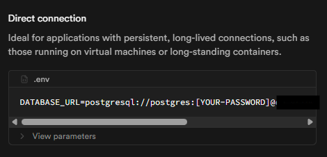

# Supaase Instructions
Link: [Supabase](https://supabase.com/)
1. Create a supabase account
2. Create a new project <br/>
    <br/>
   You can change value of any of the fields to anything of your chosing. Remember the password as we will use it soon. The region will be used again later when creating a AWS S3 bucket. This is where you should be once the project is created. In the highlighted section, click `View API settings`
   
3. From the api settings, click `Connect` the  button location on the top left side of the navbar: <br/>
    
4. Change `Type` to Python
    
5. From `Direct connection` data, copy the <br/>
    
    ```
    ## Database
    DATABASE_URL=postgresql://postgres:[YOUR-PASSWORD]@<host>:<port>/postgres
    ```
6. Copy the query below, and run it in Supabase SQL editor
    ```
    alter table auth_group enable row level security;
    alter table auth_group_permissions enable row level security;
    alter table auth_permission enable row level security;
    alter table authtoken_token enable row level security;
    alter table bugsreport_bugsreport enable row level security;
    alter table channels_postgres_message enable row level security;
    alter table comments_comment enable row level security;
    alter table django_content_type enable row level security;
    alter table django_migrations enable row level security;
    alter table following_userfollowing enable row level security;
    alter table likes_postlikes enable row level security;
    alter table notification_notification enable row level security;
    alter table posts_post enable row level security;
    alter table postviews_postviews enable row level security;
    alter table token_blacklist_blacklistedtoken enable row level security;
    alter table token_blacklist_outstandingtoken enable row level security;
    alter table tokens_tokens enable row level security;
    alter table user_sessions_session enable row level security;
    alter table users_user enable row level security;
    alter table users_user_groups enable row level security;
    alter table users_user_user_permissions enable row level security;
    ```
    Reading about RLS [here](https://supabase.com/docs/guides/database/postgres/row-level-security)

#### And you are all set.

# Or
If you want to run Postgres locally, set these in the `.env`
```
DATABASE_NAME=postgres
DATABASE_USERNAME=postgres
DATABASE_PASSWORD=<password>
DATABASE_HOST=localhost
DATABASE_PORT=5432
```
And uncomment this <br/> 
```
DATABASES = {
    # 'default': {
    #     'ENGINE': 'django.db.backends.postgresql_psycopg2',
    #     'NAME': env('DATABASE_NAME'),
    #     'USER': env('DATABASE_USERNAME'),
    #     'PASSWORD': env('DATABASE_PASSWORD'),
    #     'HOST': env('DATABASE_HOST'),
    #     'PORT': env('DATABASE_PORT'),
    # },

    # 'channels_postgres': {
	# 	'ENGINE': 'django.db.backends.postgresql',
	# 	'NAME': env('DATABASE_NAME'),
    #     'USER': env('DATABASE_USERNAME'),
    #     'PASSWORD': env('DATABASE_PASSWORD'),
    #     'HOST': 'localhost',
	# }

    ...
}

```
And comment this <br/>
```
DATABASES = {
    ...

    "default": dj_database_url.parse(os.environ.get("DATABASE_URL")),

    'channels_postgres': dj_database_url.parse(os.environ.get("DATABASE_URL")),

    ...
}
```